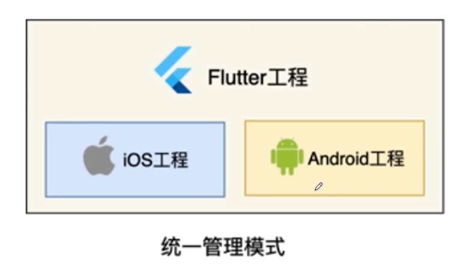
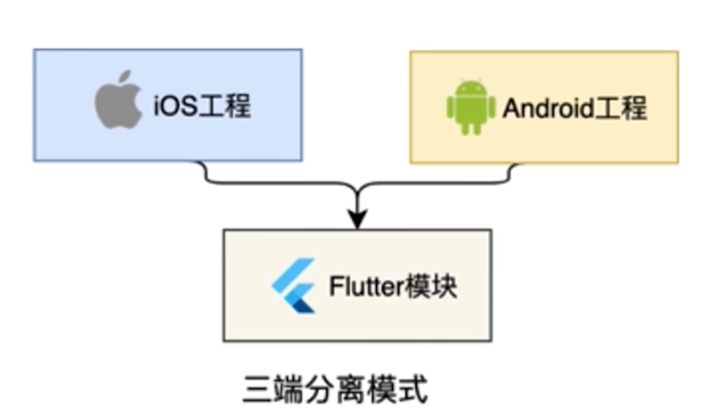
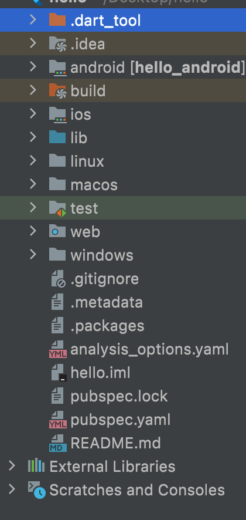

#### 一、Flutter SDK 安装与配置：
1、Flutter SDK下载：[Flutter官网](https://flutter.dev) ，[Flutter中文网](https://flutter.cn) 
2、Mac配置文件：

 ```
打开：   vim ~/.zshrc
关闭保存：source ~/.zshrc
 ```
3、配置内容：

```
#镜像地址
export PUB_HOSTED_URL=https://pub.flutter-io.cn
export FLUTTER_STORAGE_BASE_URL=https://storage.flutter-io.cn
#全局路径
export PATH=/Users/zmj/flutter/bin:$PATH
export PATH=${PATH}:/Users/zmj/flutter/bin/cache/dart-sdk/bin
```
4、检查配置命令：

```
flutter doctor
```

#### 二、开发工具安装：
1、安卓工具安装      [android-studio](https://developer.android.google.cn/studio)
2、Mac环境配置配置：
```
#Java环境变量配置
export JAVA_HOME=/Library/Java/JavaVirtualMachines/jdk-11.0.8.jdk/Contents/Home
export PATH=$JAVA_HOME/bin:$PATH:.
export CLASS_PATH=$JAVA_HOME/lib/tools.jar:$JAVA_HOME/lib/dt.jar:.
```

3、安装 Android SDK Command-line Tools：

```
 Preferences ->  System Settings -> Andrroid SDK -> SDK Platforms
```
4、安装 Android Studio插件：
 ```
    Plugins ->  Dart & Flutter
 ```


#### 三、Flutter项目管理的模式：




#### 四、Fluetter工程模式：

##### 1、Flutter APP

* 构建一个标准的FlutterApp(统一管理模式)

* 包含Dart层和平台层

##### 2、Flutter Module

* 创建一个Flutter模块(三段分离模式)

* 以模块的形式分别嵌入原生项目

##### 3、Flutter Package

* 纯Dart插件工程，不依赖Flutter

* 仅包含Dart层的实现，通常用来定义一些公共库

##### 4、Flutter Plugin

* Flutter平台插件，包含Dart、Flutter、Native的代码

* 是一种特殊的Flutter Packges

##### 5、Flutter Skeleton (Flutter 2.5之后有)

* 自动生成Flutter模板

* 提供常用框架


#### 五、统一管理模式 ----- 创建项目：

flutter create projectName

* 用法：

​	--template=type指定不同的项目类型：

>  --template=app/module/package/plugin/skeleton

* 指定平台：

​	-platforms=ios/android/windows/linux/macos/web

> -a：指定android开发使用的语言，模式kotlin
>
> -i：指定ios使用的语言，默认是swift


如：创建一个module

>  flutter create  -i swift -a java --template=module --platforms=android, ios helloFlutter

>  flutter create  -i objc -a kottlin --template=module --platforms=android, ios helloFlutter


#### 六、重新创建指定语言的android/ios目录：

##### 1、移除android目录，重新创建指定语言的android目录

```
①、进入工程目录，删除android目录
	rm -rf android
 
②、重新创建java语言的android目录
	flutter create -a java .
 
③、重新创建kotlin语言的android目录
	flutter create -a kotlin .
```

##### 2、移除ios目录，重新创建指定语言的ios目录

```
①、进入工程目录，删除ios
	rm -rf ios 
 
②、重新创建指定swift语言的ios目录
	flutter create -i swift .
 
③、重新创建指定objective-c 语言的ios目录
	flutter create -i objc .  
```


#### 七、Flutter工程目录结构：



|          文件          |                          作用                          |
| :--------------------: | :----------------------------------------------------: |
|       dart_tool        |                     Dart工具开发包                     |
|         .idea          |                      开发环境配置                      |
|        android         |                    安卓原生工程文件                    |
|         build          |                    编译或运行后产物                    |
|          lib           |              包含.dart结尾的工程相关文件               |
|          ios           |                    ios原生工程文件                     |
|         linux          |                   linux原生工程文件                    |
|         macos          |                    mac原生工程文件                     |
|          test          |              包含.dart结尾的工程测试文件               |
|          web           |                    web原生工程文件                     |
|        windows         |                  windows原生工程文件                   |
|       .gitignore       |                  git提交仓库忽略文件                   |
|       .metadata        |             一个对当前workspace的配置记录              |
|       .packages        |                以lib结尾的文件绝对路径                 |
| analysis_options.yaml  |                      静态分析文件                      |
|       my_app.iml       |                 工程文件的本地路径配置                 |
|      pubspec.lock      |                 前项目依赖所生成的文件                 |
|      pubspec.yaml      |                        依赖配置                        |
|       README.md        |                 自述项目信息(html标签)                 |
|   External Libraries   | 安卓架包和资源文件、Dart SDK 文件、工程开发依赖插件API |
| Scratches and Consoles |               创建的临时文件和缓冲区列表               |
